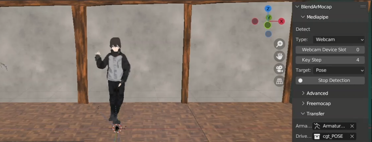

<h1 align="center">

</h1> 

# Mocap for All
| Demo        | Description | 
|-------------|-----| 
|  | 
 Democratized motion capture via: Real Time Pose Transfer onto 3D Characters. An affordable motion capture system that uses real-time pose  estimation to replace the expensive equipment. A comprehensive  evaluation of state-of-the-art pose estimation algorithms and  demonstrate their practical use in real-time 3D avatar animation required for traditional motion capture.
|

## 🔑 Key Feature
- A comprehensive comparison of multiple realtime pose estimation method
- A blender plugin to transfer your pose in real time to a 3D character
- Real time pose recording without motion capture suit

## 🧑‍💻️ Usage

### Go into amazon_webscraper.py and do these changes

### Open pose - pose estimation preview

### Mask RCNN - pose estimation preview

### Move Net - pose estimation preview

### Media pipe - pose estimation preview

### Pose Net - pose estimation preview

### Mask RCNN - pose estimation preview

### Step 6: PROFIT!!!

## 💻 Sample Output

## 🛠 Skills
Python , Computer Vision , Deep Learning , Blender , Unreal Engine , 3D model Rigging 

## 📖 Libraries Used
Posenet, yolo , maskrcnn , openpose, media pipe, blaze pose

## 📃 Lessons Learnt

- Implementing multiple pose estimation libraries
- Difficulty of working with 3D rendering software

## 🔮 Future Scope

- Unreal Engine rigging to automate videogame motion capture
- Customized emojis using media-pipe face and hand tracking
